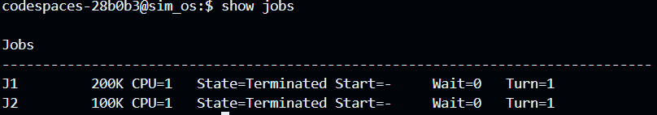
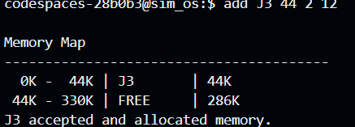

# Operating System Simulator

A command-line **Operating System Simulator** that demonstrates fundamental operating-system concepts through job management and dynamic memory allocation.

## Overview

The project simulates a simplified operating system where users can create and terminate jobs while observing how physical memory is allocated and released.

Rather than using a traditional numbered menu, the simulator provides an **interactive shell** where commands such as `add`, `end`, `show jobs`, and `show memory` can be entered directly.

The project is intended as an educational simulation of OS memory-management concepts rather than a complete operating system.

## Features

* Interactive command-line shell
* Job creation and termination
* Dynamic memory partitioning
* Memory allocation and deallocation
* Memory-map visualization
* Detection of allocation failures
* Free-block coalescing after job termination
* Job status/state display
* Command validation and error handling
* `help` command for available operations
* `definitions` command for viewing related concepts

### Memory Management

The simulator demonstrates dynamic partitioning, where memory is allocated according to a job's requested size.

When a job terminates, its allocated partition becomes free. Adjacent free partitions are merged to reduce fragmentation.

For example:

```text
Before:
+----------+----------+----------+
|  FREE    |    J1    |  FREE    |
|  100 MB  |  200 MB  |  300 MB  |
+----------+----------+----------+

After J1 terminates:
+-------------------------------+
|             FREE              |
|             600 MB            |
+-------------------------------+
```

The project can therefore be used to demonstrate concepts such as **dynamic partitioning, external fragmentation, allocation, deallocation, and coalescing**.

## Technology

* **Language:** Python
* **Interface:** Interactive command-line shell
* **Paradigm:** Object-oriented programming

## Requirements

Before running the project, ensure that you have:

* Python v3.5+
* A terminal or command prompt
* A python IDE such as PyCharm or VS Code

Verify Python is installed:

```bash
python -v
```

## Getting Started

### 1. Clone the repository

```bash
git clone https://github.com/sprusrxeroxx/Uni-Projects
cd os-simulator
```

### 2. Run program

Run the main module.

```bash
python main.py
```

## Usage

After starting the application, the simulator displays an interactive prompt:

```text
user@sim_os:$ 
```

Commands can then be entered directly.

### Display Jobs

```text
show jobs
```

Displays the jobs currently managed by the operating system.

### Display Memory

```text
show memory
```

Displays the current memory layout, showing allocated and free regions.

### Add a Job

```text
add J1 200 2 1
```

Creates/submits a job.

General syntax:

```text
add <job-id> <memory> <parameter> <parameter>
```

The additional parameters correspond to attributes used by the simulator's existing job model.

### End a Job

```text
end J1
```

Terminates the specified job and releases its allocated memory.

Syntax:

```text
end <job-id>
```

### Display Available Commands

```text
help
```

Displays the commands supported by the shell.

### Exit

```text
exit
```

Terminates the simulator.

## Example Session

```text
========================================
             _.-;;-._
      '-..-'|   ||   |
      '-..-'|_.-;;-._|
      '-..-'|   ||   |
      '-..-'|_.-''-._|        
      
      welcome to SIM OS

Type 'help' to see available commands.
codespaces-28b0b3@sim_os:$ add J1 200 1 20
J1 accepted and allocated memory.
codespaces-28b0b3@sim_os:$ help

Available commands:

  add <id> <memory> <burst> <arrival>   Add a job
  end <id>                              Finish a job
  run                                   Run the CPU

  show jobs                             Show all jobs
  show memory                           Show memory map
  show ready                            Show ready queue
  show gantt                            Show Gantt timeline
  show log                              Show event log
  show devices                          Show printer status

  set memory ff                         Use First-Fit
  set memory bf                         Use Best-Fit
  set cpu fcfs                          Use FCFS
  set cpu rr <quantum>                  Use Round Robin

  request printer <id>                 Request the printer
  release printer                      Release the printer

  help                                  Show this help
  exit                                  Exit the simulator
  clear                                 Clear the screen
  definitions                           Show definitions

codespaces-28b0b3@sim_os:$ exit
Goodbye!
```

## How It Works

The system is divided into several logical components.

```text
User
  │
  ▼
Interactive Shell
  │
  ▼
Command Parser / Dispatcher
  │
  ├──► Job Management
  │
  └──► Memory Management
          │
          ▼
      Memory State
```

### Command Processing

The shell reads a user's command and separates it into a command name and arguments.

For example:

```text
add J1 200 2 1
```

is interpreted as:

```text
Command: add
Arguments: J1, 200, 2, 1
```

The shell then delegates the operation to the appropriate system component.

### Job Management

When a job is added, the system:

1. Creates the job.
2. Determines the required memory.
3. Attempts to allocate memory.
4. Updates the system state.
5. Makes the job available through `show jobs`.

When a job ends:

1. The job is located.
2. Its execution/state is terminated.
3. Its memory is released.
4. Adjacent free blocks are merged where applicable.
5. The updated state becomes visible through `show memory`.

### Dynamic Partitioning

Unlike fixed partitioning, memory is divided dynamically according to the requirements of incoming jobs.

Example:

```text
| J1 200 MB | J2 300 MB | FREE 500 MB |
```

If `J1` terminates:

```text
| FREE 200 MB | J2 300 MB | FREE 500 MB |
```

If `J2` subsequently terminates, the adjacent free regions can be coalesced into a larger free region.

This also allows the simulator to demonstrate **external fragmentation**, where enough total memory may exist but no single contiguous block is large enough for a new job.

## Project Structure

A typical project structure is:

```text
OperatingSystemSimulator/
├── src/
│   ├── main.py
│   ├── simulator.py
│   ├── cpu_manager.py
│   ├── device_manager.py
│   ├── memory_manager.py
│   ├── models.py
│   └── ...
├── screenshots/
│   ├── shell.png
│   ├── jobs.png
│   └── memory-map.png
├── tests/
│   ├── test_cpu_manager.py
│   ├── test_memory_manager.py
│   ├── test_device_manager.py
│   ├── test_simulator.py
├── README.md
└── ...
```

The exact class names may differ depending on the current implementation.

The main responsibilities are separated conceptually into:

| Component                  | Responsibility                            |
| -------------------------- | ----------------------------------------- |
| Shell / Main               | User interaction and command execution    |
| Command handling           | Parsing and validating shell commands     |
| Job management             | Creating, tracking and terminating jobs   |
| Memory management          | Allocation, deallocation and memory state |
| Memory blocks / partitions | Representing regions of physical memory   |

## Screenshots

### Interactive Shell

```markdown

```

### Job Management

```markdown

```

### Memory Map

```markdown

```

Replace the filenames above with the actual screenshots included in the repository.


## Educational Purpose

This project is intended to reinforce practical understanding of operating-system concepts, particularly:

* Process/job management
* Dynamic memory partitioning
* Memory allocation
* Memory deallocation
* External fragmentation
* Free-space coalescing
* Command interpreters
* Separation of system components

It provides a small, observable environment in which changes to jobs immediately affect the simulated memory state.

## Future Improvements

Possible future extensions include:

* Paging and page-table simulation
* Demand paging
* More advanced shell commands
* Improved memory visualization
* Logging and simulation statistics

## License

Apache license 2.0

## Authors

**[Ntokozo Lifa Vilakazi]**
**[Ndwalane S'bongakonke]**
**[Khumbudzo Mulaudzi]**
**[Wiseman Madonsela]**
**[Mfundo Lubisi]**
**[Lindokuhle Jaxa]**
**[Yamkelwa Nonyosi]**
**[Lusanda Hlongwane]**
**[Sinethemba Percevarence Mathenjwa]**


Operating Systems Project

GitHub: `https://github.com/sprusrxeroxx/`

Email: `ntokozovilakazi36@gmail.com`

## Acknowledgments

This project was developed for educational purposes and is based on fundamental operating-system concepts taught in coursework.

References and concepts used include standard material covering:

* Operating-system memory management
* Dynamic partitioning
* Memory allocation strategies
* Fragmentation and partition coalescing
* Paging and virtual memory concepts

Special thanks to the educators, course material, documentation, and open-source resources that support the study of operating-system design.

---
